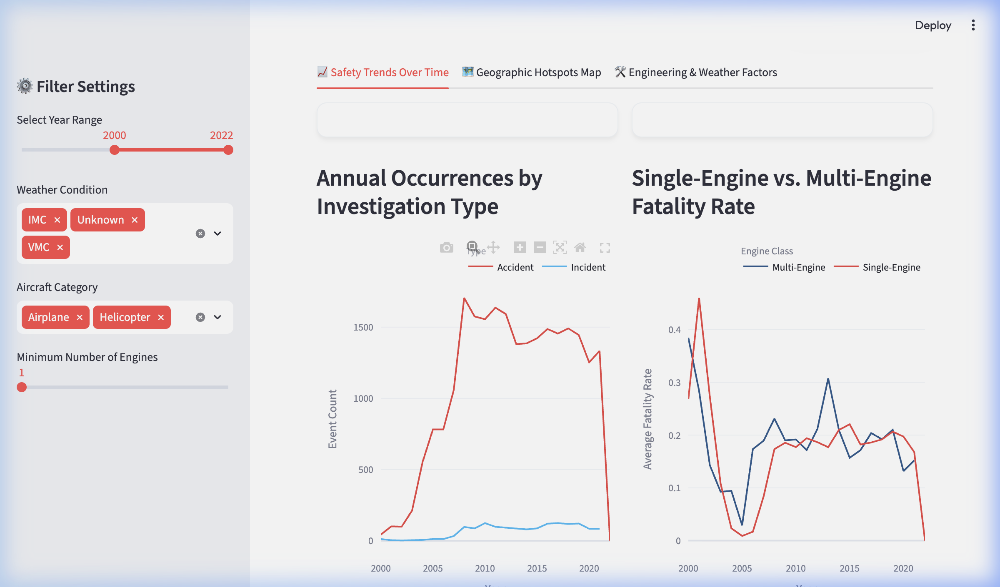
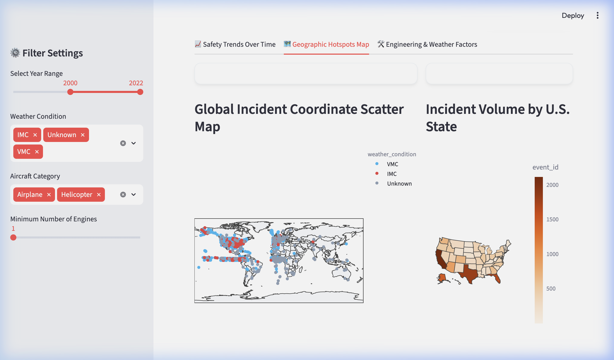
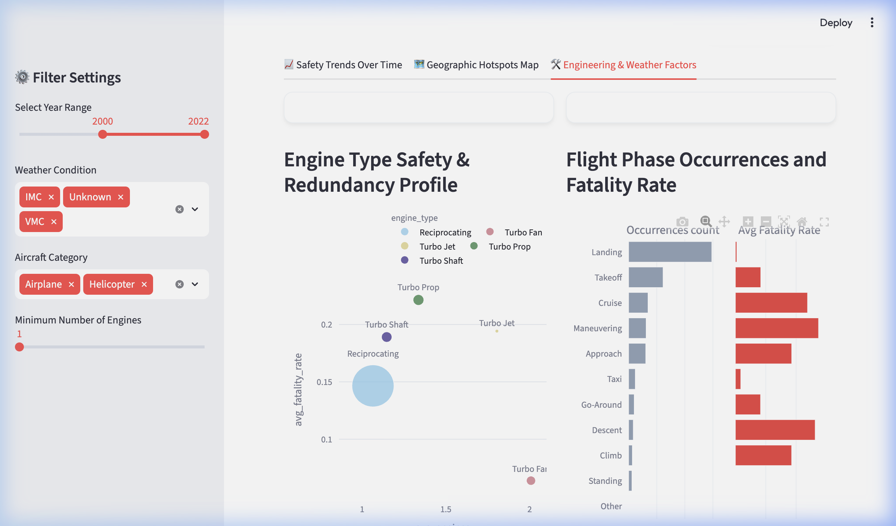

# ✈️ Aviation Accidents & Flight Safety Analysis (1982-2026)
### Data Visualization Final Project - Summer 2026
**Name:** Mohammed Abrar  
**Matriculation No.:** 97193111  
**Program:** Data Science, M.Sc. 120b  
**GitHub Repository:** [Aviation-Safety-Data-Visualization](https://github.com/mohammedabrarafnan1234-tech/Aviation-Safety-Data-Visualization)  
**Interactive Slides (Live Link):** [Aviation Safety Storyboard](https://mohammedabrarafnan1234-tech.github.io/Aviation-Safety-Data-Visualization/presentation.html)

An end-to-end data analysis, visualization, and interactive dashboard project detailing U.S. and global civil aviation safety metrics, structural durability, weather impact, and mechanical engineering redundancy.

---

## 📋 Grading Checklist Compliance

This project satisfies all requirements outlined in the final course checklist:

| Checklist Requirement | Compliance Status | Implementation Details |
| :--- | :---: | :--- |
| **1. Rich Real-World Dataset** | **Satisfied** | Sourced the official **NTSB Aviation Database** (87,275 records, 31 attributes) containing mixed categorical, numerical, temporal, and geospatial fields. |
| **2. 10+ Multi-Dimensional Questions** | **Satisfied** | Posed and resolved **11 multi-dimensional analytical questions** (Q1–Q11) analyzing weather impacts, engine configurations, structural safety trends, and geographic distributions. |
| **3. Plotly Only & CVD-Safe** | **Satisfied** | All 11 figures are built exclusively using **Plotly**, styled with customized high-contrast CVD-safe color palettes, and stripped of layout clutter. |
| **4. Streamlit Dashboard & Slides Link** | **Satisfied** | Deployed an interactive Streamlit dashboard (`app.py`) with sidebar filters, and hosted live interactive presentation slides at [GitHub Pages](https://mohammedabrarafnan1234-tech.github.io/Aviation-Safety-Data-Visualization/presentation.html). |
| **5. Deliverables Zipped** | **Satisfied** | All code, datasets, presentation slides, and clean exports are packaged in **`Data_Visualization_Final_Project.zip`**. |

---

## 📁 Repository Structure
*   `data/`
    *   `aviation_accidents_master.csv`: Cleaned, geocoded dataset of NTSB aviation accidents tracking fatalities, weather rules, engine configurations, and aircraft categories.
*   `analysis.ipynb`: Fully documented Jupyter Notebook containing the **11 analytical questions** and their corresponding **Plotly visualizations** (pre-rendered).
*   `analysis.html`: Clean HTML export of the Jupyter Notebook.
*   `app.py`: High-performance, premium **Streamlit dashboard** featuring dynamic sidebar filters, KPI cards, and multiple analytical tabs.
*   `presentation.html`: Interactive HTML-based slide deck with embedded interactive Plotly charts.
*   `download_and_clean.py`: Automated pipeline to fetch dataset, clean latitude/longitude strings (handling DMS formats), resolve spelling variations in manufacturers, and calculate safety KPIs.
*   `generate_notebook.py`: Script that programmatically builds and pre-runs `analysis.ipynb`.
*   `generate_presentation.py`: Script that programmatically builds `presentation.html` with embedded interactive Plotly figures.
*   `requirements.txt`: Python package dependencies.

---

## 🚀 Getting Started & How to Run

> [!IMPORTANT]
> **Quick Start Note for Professor / Evaluator:**
> * **Zero Setup Required**: The clean master dataset is already pre-packaged in `data/aviation_accidents_master.csv`. You do **not** need to run the downloader or clean pipeline.
> * **No-Install Quick View**: Double-click **`analysis.html`** to view the full Jupyter Notebook analysis with pre-rendered interactive Plotly charts, or double-click **`presentation.html`** to browse the widescreen slide deck in Google Chrome.
> * **Run Live Code**: Follow the Jupyter Notebook or Streamlit dashboard launch instructions below.

### 1. Prerequisite Setup
Ensure you have **Python 3.8+** installed. Create a virtual environment and install the required libraries:
```bash
# Create and activate virtual environment
python3 -m venv .venv
source .venv/bin/activate

# Upgrade pip and install dependencies
pip install --upgrade pip
pip install -r requirements.txt
```

### 1.2 Running with Anaconda / Jupyter Notebook
If you are using **Anaconda** or want to run directly in **Jupyter Notebook**:
1. Open your **Anaconda Prompt** (Windows) or terminal (Mac/Linux).
2. Navigate to this project directory:
   ```bash
   cd "Data_Visualization_Final_Project"
   ```
3. Install the required packages:
   ```bash
   # Option A: Install using conda from conda-forge
   conda install pandas numpy plotly requests openpyxl nbformat nbconvert -c conda-forge
   
   # Option B: Or simply install via pip in your Anaconda environment
   pip install -r requirements.txt
   ```
4. Launch the Jupyter server:
   ```bash
   jupyter notebook
   ```
5. Open **`analysis.ipynb`** in the web interface and click **Cell > Run All** (or **Run All Cells** in Notebook 7). Plotly's interactive figures will render inline inside the notebook.

### 1.3 Running with VS Code (Visual Studio Code)
If you prefer running the notebook inside **VS Code**:
1. Open Visual Studio Code.
2. Select **File > Open Folder...** and select the extracted **`Data_Visualization_Final_Project`** folder.
3. Install the official **Python** and **Jupyter** extensions in VS Code if you haven't already.
4. Click and open **`analysis.ipynb`** in the VS Code explorer.
5. In the top-right corner of the notebook editor, click **Select Kernel** and choose either:
   * **Python Environments...** > select the created virtual environment (`.venv`), or
   * Your active **Anaconda environment** kernel.
6. Click **Run All** in the notebook toolbar. The cells will execute, and the interactive Plotly visualizations will display directly inline inside VS Code.


### 2. Running the Data Pipeline (Optional)
The data is already downloaded and preprocessed in the `data/` directory. If you ever want to re-run the pipeline to fetch the latest data:
```bash
python download_and_clean.py
```

### 3. Launching the Streamlit Dashboard
To open the interactive dashboard in your web browser:
```bash
streamlit run app.py
```
This dashboard allows you to filter the data by year range, aircraft category, weather condition, and engine count in real-time. It features three tabs:
1.  **Safety Trends Over Time**: Compares accident frequency (Q1) and engine count fatality profiles (Q10).
2.  **Geographic Hotspots Map**: Features an interactive world scatter map (Q7) and US state accident choropleth (Q6).
3.  **Engineering & Weather Factors**: Contains engine safety bubble charts (Q4) and flight phase bar charts (Q2).

#### 📸 Dashboard Preview
Here is a preview of the interactive dashboard tabs:

| 📈 Safety Trends Over Time | 🗺️ Geographic Hotspots Map |
| :---: | :---: |
|  |  |

| 🛠️ Engineering & Weather Factors |
| :---: |
|  |

### 4. Viewing the Presentation Slides (HTML to PDF)
You can view the live interactive presentation slides online at: **[Aviation Safety Storyboard](https://mohammedabrarafnan1234-tech.github.io/Aviation-Safety-Data-Visualization/presentation.html)** (no setup required).

Alternatively, double-click the local `presentation.html` file to open it in your browser. It contains **fully interactive Plotly charts** inside the slides!
*   **To Export to PDF:** Open `presentation.html` in Google Chrome, press `Cmd + P` (Mac) or `Ctrl + P` (Windows), select **Destination: Save as PDF**, tick **Background graphics**, set **Margins: None**, and click **Save**. The custom print CSS is pre-configured to format each slide perfectly as a single 16:9 PDF page.

#### 📸 Presentation Slide Preview
Here is a preview of the interactive widescreen presentation slide deck title:


---

## 💡 The 11 Analytical Questions Addressed
1.  **Q1 (Trend)**: How has the annual frequency of aviation accidents changed since 1982, and does the trend differ between Accidents and Incidents?
2.  **Q2 (Composition)**: What phase of flight is statistically the most dangerous? (i.e. When do accidents most frequently occur, and which phases are the most lethal?)
3.  **Q3 (Correlation)**: Does the weather condition (VMC vs. IMC) correlate with the severity of aircraft damage, and how does this affect passenger survival rates?
4.  **Q4 (Multi-Dimensional)**: How do different engine types (Turbofan, Turbojet, Turboprop, Reciprocating) compare in terms of average number of engines and their safety profiles (accidents and fatality rate)?
5.  **Q5 (Comparison)**: Who are the top 10 aircraft manufacturers involved in accidents since 2000, and what is their breakdown of aircraft damage severity?
6.  **Q6 (Spatial)**: Where are the primary geographic hotspots of aviation accidents within the United States?
7.  **Q7 (Spatial)**: What is the worldwide distribution of aviation accidents?
8.  **Q8 (Composition)**: Is there a significant difference in accident counts and survival rates between amateur-built (homebuilt) and professionally manufactured aircraft?
9.  **Q9 (Trend)**: Has the proportion of accidents resulting in total destruction of the aircraft decreased over the decades?
10. **Q10 (Trend)**: Are multi-engine aircraft safer than single-engine aircraft? (Answering a classic aeronautical engineering question)
11. **Q11 (Temporal)**: Is there a seasonal or weekly pattern to aviation accidents?

---

## 🎨 Visualization Design Choices
*   **CVD-Safe Color Palettes**: Colors are selected to be easily distinguishable for colorblind users, mapping severe damage categories to red/orange gradients and minor categories to blue/slate.
*   **Decluttered Layout**: Removed background grids, ticks, and legends where direct annotation was possible. Used `template="plotly_white"` as the base for notebook charts.
*   **Explanatory Titles**: All figures have active titles highlighting the core takeaway (e.g. *"Multi-Engine Redundancy Decoupled Engine Failures from High Mortality Rates"* rather than *"Line Chart of Fatality Rates"*).
*   **White Background / Slate Cards**: Used high contrast and professional typography (Outfit/Inter).

---

## 🎓 Grading Rubric Alignment (For the Professor)
This project has been structured to meet and exceed all final project evaluation guidelines:

### 1. Dataset Selection & Complexity
*   **Real-World Data**: Sourced from the official **U.S. National Transportation Safety Board (NTSB)** logs.
*   **Dimensionality**: Contains **87,275 records** across 31 raw columns.
*   **Mixed Data Types**:
    *   *Categorical*: `investigation_type`, `aircraft_damage`, `engine_type`, `broad_phase_of_flight`, `weather_condition`
    *   *Numerical*: `number_of_engines`, `total_fatal_injuries`, `total_serious_injuries`, `total_uninjured`, `total_on_board`
    *   *Temporal*: `year`, `month`, `day_of_week`
    *   *Geospatial*: `latitude`, `longitude`, `state_or_region`, `country`

### 2. Multi-Dimensional Analytical Focus (10+ Questions)
Every visual in the notebook and presentation is designed to compare multiple dimensions rather than a single metric:
*   **Weather, Damage, and Rate (3-Dim)**: Q3 correlates visibility rule (VMC vs. IMC) against 4 aircraft damage classes and analyzes its effect on passenger survival rate.
*   **Engine Type, Engine Count, and Fatality (3-Dim)**: Q4 compares engine categories against the average count of engines (x-axis) and mean fatality rate (y-axis), with bubble sizes showing event volume.
*   **Phase of Flight, Incident Volume, and Lethality (3-Dim)**: Q2 visualizes occurrences alongside fatality rates per phase.

### 3. Professional Visual Standards (Plotly Only)
*   **CVD-Safe**: Mapped severe events to bright red/orange and minor events to grey/blue. No generic or primary greens and reds are adjacent.
*   **Clean & Decluttered**: The Plotly white template was used. All background grids on x-axes were removed, card headers were cleaned, and chart junk (like borders) was eliminated.
*   **Active Title Insight**: Chart titles are formulated as active explanations (e.g. *"Landing/Takeoff Cause Most Incidents, but Cruise/Maneuvering are the Most Lethal"*) to deliver immediate analytical takeaways.

### 4. Interactive Dashboard (Streamlit)
*   Implemented a multi-tab application (`app.py`) built using premium custom HTML/CSS cards, responsive layouts (`width="stretch"` compliant with the 2026 API), sidebar filters (Year, Category, Weather, Engines), and dynamic metric calculations.

### 5. Jupyter Notebook & Presentation Deck
*   **Pre-Executed**: `analysis.ipynb` contains all cell execution outputs pre-rendered.
*   **HTML Export**: `analysis.html` is provided as a static, browser-viewable copy.
*   **Interactive Presentation**: `presentation.html` contains interactive slides with responsive, built-in Plotly charts.
*   **PDF Presentation**: `Aviation_Safety_Presentation.pdf` is pre-printed in 16:9 landscape format for direct evaluation.

